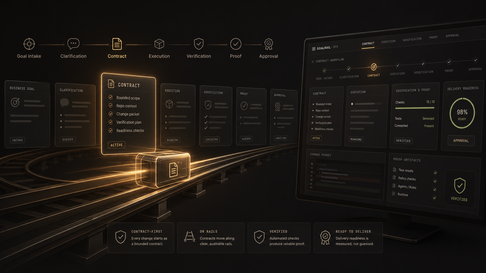

# Goalrail

[Русский](README.ru.md)

Goalrail is a productized operating layer for AI-assisted delivery.

**Tagline:** from business goal to verified code change.

## What it is

Goalrail helps software teams move from intent to a bounded, verified delivery change.
It sits between planning and execution:
- clarifies goals and constraints
- shapes bounded delivery contracts
- executes through existing developer runtimes
- returns verification and proof, not just status

## Current state

Goalrail's product canon, MVP shape, and operating model are documented,
and an early Go server prototype now exists under `apps/server` with a
bounded persistence slice.

The implemented slice covers a server-owned lifecycle from intake through
work-item planning:
IntakeRecord → Goal → ContractSeed → ContractDraft (`draft`) →
ContractDraft (`ready_for_approval`) → ApprovedContract (`approved`) →
WorkItem (`planned` prototype). HTTP routes, Postgres-backed persistence
for the core canonical objects, migrations, and event append for the key
transitions are in place.

This is **not** a full Goalrail runtime and **not** an agent platform.
Goalrail remains a contract-first, bounded control plane that supplements
existing developer and business tools rather than replacing them.

## Repo surfaces

- `apps/server` — early Go server prototype and bounded persistence slice; see
  `apps/server/README.md`.
- `apps/cli` — early local/demo Go CLI.
- `apps/web` — shared web workspace with console shells, demo surfaces, and the
  RU pilot landing; see `apps/web/README.md`.

## What is not implemented

- runner, workers, queue / jobs, or repo checkout
- gate, proof generation, or runnable eval harness
- durable `WorkItem` storage or durable clarification persistence
- authn / authz, tracker sync, analytics, CRM, or product web loop
- broad backend platform, LLM/API calls, repo integration, or runtime execution

## Read first

- `docs/INDEX.md`
- `docs/product/GOALRAIL_PRODUCT_BRIEF.md`
- `docs/product/GOALRAIL_MVP_BLUEPRINT.md`
- `docs/product/GOALRAIL_BUILD_ROADMAP.md`

## Contact

- [hello@goalrail.dev](mailto:hello@goalrail.dev)

## Open source and community

- [LICENSE](LICENSE)
- [CONTRIBUTING](CONTRIBUTING.md)
- [CODE_OF_CONDUCT](CODE_OF_CONDUCT.md)
- [SECURITY](SECURITY.md)
- [SUPPORT](SUPPORT.md)
- [TRADEMARKS](TRADEMARKS.md)
