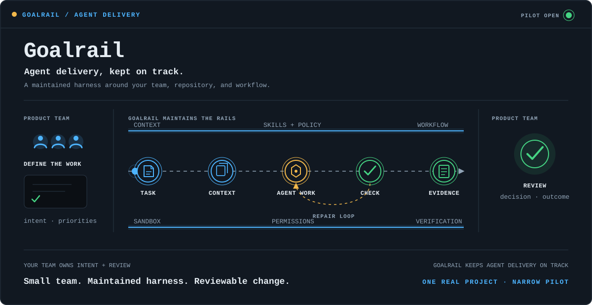

<div align="center">

<picture>
  <source media="(prefers-color-scheme: dark)" srcset="assets/goalrail-dark.svg">
  <source media="(prefers-color-scheme: light)" srcset="assets/goalrail-light.svg">
  
</picture>

**A coding agent that asks instead of guessing.**

</div>

Goalrail installs a harness into one repository. After that the agent you already
use — in the tool you already use — works against intent you confirmed, and when
the work cannot be done as specified it writes the question down and stops
instead of inventing an answer.

You run no Goalrail command per task. You start sessions the way you always do.

## Install

No Go toolchain needed. Download the archive for your platform, verify it, and
put the binary somewhere it will stay:

```sh
base=https://github.com/heurema/goalrail/releases/latest/download
curl -fsSLO "$base/checksums.txt"
archive=$(awk '/darwin_arm64/ { print $2 }' checksums.txt)   # your platform, from the table below
curl -fsSLO "$base/$archive"
shasum -a 256 --ignore-missing -c checksums.txt              # Linux: sha256sum --ignore-missing -c
mkdir -p ~/.local/bin && tar -xzf "$archive" -C ~/.local/bin gr
```

`checksums.txt` is the only file whose name is the same in every release, so it
is where you find the current archive names without knowing the version.
`--ignore-missing` matters: without it the check fails over the three archives you
did not download.

| Platform | Archive |
|---|---|
| macOS, Apple silicon | `gr_<version>_darwin_arm64.tar.gz` |
| macOS, Intel | `gr_<version>_darwin_amd64.tar.gz` |
| Linux, x86-64 | `gr_<version>_linux_amd64.tar.gz` |
| Linux, arm64 | `gr_<version>_linux_arm64.tar.gz` |

Keep the binary where you put it. `gr init` records that exact path in the
session hooks it registers, and `gr doctor` reports the attachment as broken if
the file is no longer there — so a binary left in a downloads folder stops
working the day you tidy up.

Then, in the repository you want it in, with `~/.local/bin` on your `PATH`:

```sh
gr init
```

That is the whole installation for scaffolds whose settings layer allows it. `gr
init` prints exactly what it created, what it changed, and what it left alone.

**macOS:** the binaries are not notarized. Downloaded with `curl` as above, they
carry no quarantine flag and run without a prompt.

Downloaded through a browser, the archive is quarantined and the flag survives
extraction — with Finder and with `tar` alike. macOS then blocks the binary, and
what you see is not an error: the command hangs on a Gatekeeper prompt and prints
nothing. Clear the flag *before* the first run:

```sh
xattr -d com.apple.quarantine ~/.local/bin/gr
```

If you already ran it and it was blocked, clearing the flag afterwards does not
release it — extract a fresh copy and clear that one before running it. macOS's
own route is System Settings → Privacy & Security → Open Anyway; Control-clicking
the file has not overridden Gatekeeper since macOS Sequoia.

**Windows is not supported.** The escalation artifact is opened with
`O_NOFOLLOW|O_NONBLOCK`, flags Windows does not have, and those flags are how the
"never follow a link out of the repository" guarantee is implemented. A stub that
compiled would drop that guarantee silently, so there is no Windows build until
supporting it means keeping the guarantee. If you need one, say so.

### Or install with Go

```sh
go install github.com/heurema/goalrail/cmd/gr@latest
```

Once a release is tagged, `@latest` resolves to that tag rather than to the tip of
`main`. This route needs a Go toolchain; the download above does not.

### Or hand it to your agent

Goalrail is meant to be installed by the agent, not by hand. Paste this:

> Install Goalrail in this repository. Do not use `go install`; this machine may
> have no Go toolchain. Fetch
> `https://github.com/heurema/goalrail/releases/latest/download/checksums.txt`,
> pick the archive matching this machine's operating system and architecture —
> `darwin_arm64`, `darwin_amd64`, `linux_amd64`, or `linux_arm64` — and download
> it from that same `releases/latest/download/` prefix. Verify it with `shasum -a
> 256 --ignore-missing -c checksums.txt` on macOS or `sha256sum --ignore-missing
> -c checksums.txt` on Linux. Extract `gr` into `~/.local/bin`: that one write
> outside this repository is expected, and the binary has to stay there because
> the session hooks record its absolute path. Then run `~/.local/bin/gr init` in
> the repository root. If its report refuses the registration, show me the
> `refused` text verbatim rather than acting on it: it names which of several
> causes applies and whether `--fix-gitignore` can help at all. If it says no
> supported scaffold was detected, tell me that verbatim without guessing why: the
> harness is still installed, and the diagnosis will report the attachment as
> missing for that reason rather than because anything failed. Finally run `~/.local/bin/gr doctor` and show me its output
> verbatim. Apart from `~/.local/bin/gr`, Goalrail's own state directory at
> `~/.local/state/goalrail` — which `gr doctor` writes its update-check cache
> into — and a scratch download directory you clean up, do not edit any file
> outside this repository.

The last step is the point: the agent proves the installation rather than
claiming it.

## What `gr init` writes

Nothing is installed anywhere you did not name, and nothing lands in a file a
commit could hand to a teammate.

| Path | What it is |
|---|---|
| `openspec/schemas/goalrail-intent/**` | The workflow schema and its templates, materialized from a copy inside the binary |
| `openspec/config.yaml` | Created if absent; afterwards only its `schema:` key is managed |
| `.goalrail/ambient.json` | The marker that says this repository participates — git-ignored, per clone |
| `.claude/settings.local.json` | The session hooks, in the per-user project file, **only if git ignores it** |
| this clone's own exclude rule | The two entries that make the lines above ignored — kept wherever git keeps it for this clone, and named in the report; no commit can carry it |

A registration a commit could carry would run in every teammate's session on your
consent alone. So `gr init` makes those two paths unshareable itself, using the
ignore rule that stays inside your clone — it never edits `.gitignore`, which
your repository hands to everyone who clones it, and never touches your
user-level scaffold configuration.

Where that is not enough it refuses rather than guessing, and the refusal names
the rule that actually decided. A settings path your repository already tracks
cannot be fixed by any ignore rule; a shared rule that overrides this clone's can
be, and `--fix-gitignore` is what adds the entries there.

To remove the attachment: `gr disconnect --scaffold <name>`. The files above are
ordinary repository content — deleting them is your act, not ours.

## Checking for updates

`gr doctor` tells you whether a newer Goalrail has been released. It is a line of
information, not a demand: nothing about your repository changes because of it,
and the exit code does not move.

What leaves your machine is one request to `proxy.golang.org` — the same service
`go install` already asks about this module — for the newest released version.
The request's URL names the module, `github.com/heurema/goalrail`, because that
is what it is asking about; that is its one disclosure, and it is the same one a
`go install` of this tool already makes. Beyond it the request carries nothing:
no version, no platform, no repository, no query parameter, and no header the Go
toolchain itself would not send for the same module — which is why the report
names the service it asked rather than the request naming you.

The answer is remembered for a day, so repeated diagnoses ask nothing. A binary
that is not itself a release — built from a checkout, from a modified tree — never
asks at all: there would be nothing to conclude.

**Turning it off.** Either of these is enough:

```sh
export GR_NO_UPDATE_CHECK=1        # this check only
go env -w GOPROXY=off              # every module lookup on this machine, including this one
```

The second is not a special case Goalrail added. If you have already told the Go
toolchain your module lookups stay home — with `GOPROXY`, `GOPRIVATE`, or
`GONOPROXY` — this check reads that and does not ask. It also never runs in
continuous integration.

## The loop

1. A session opens. The agent is told, in one fixed line, that this repository
   accepts one escalation and where to write it.
2. The agent works. If the task cannot be completed as specified — contradictory
   requirements, a decision that is not its to make — it writes the question to
   `.goalrail/blocked.md` and changes nothing else.
3. The session ends. The question is retained outside the repository, with its own
   identity and a link to the intent it belongs to, so deleting the file loses
   nothing.
4. You answer by confirming a new version of the intent. The next session works
   from that.

There is no second answering mechanism, no dialogue, no resume.

## Commands

| Command | What it does |
|---|---|
| `gr init` | Install the harness here, and register the session hooks where the scaffold allows it |
| `gr doctor` | Report whether the harness is intact: attachment, overlay drift per file, toolchain, observability, and whether a newer release exists. Exits `0` healthy, `1` a problem you can act on, `2` the check itself did not run |
| `gr update` | Bring this repository's harness up to what the installed `gr` carries. Stops rather than overwriting a local edit; keeps a recoverable copy |
| `gr connect` | Attach a scaffold that can only register at user scope; needs `--yes` |
| `gr disconnect` | Remove every registration, in whichever scope it lives |
| `gr version` | This binary's version and the overlay it carries |

Run `gr help` for the rest.

## Supported scaffolds

**Claude Code** — `gr init` is the whole attachment. The hooks are registered in
the repository, so they are never invoked in unrelated sessions at all. A live
session confirmed a registered hook runs with no approval step.

**Codex** — registering inside a repository is blocked there by an external
defect, so it registers at user scope: `gr connect --scaffold codex --yes`, then
review and trust the hooks with `/hooks` inside Codex. Until you do, nothing runs.
`gr doctor` names that state, which otherwise looks exactly like a broken install.

## Status

Early, and honest about it.

**Works today:** installation from a published binary or from source, the
diagnosis, the update path, the escalation loop end to end on Claude Code, and the
intent-first workflow this repository is itself developed with.

**Not there yet:** the binaries are not signed or notarized, and there is no
package manager, install script, or Windows build; observability is bring-your-own
detection only, with no exporter; and `gr update` refreshes this repository's
harness, never the `gr` binary — `gr doctor` reports when a newer release exists,
but applying it is still a new download or `go install`.

Installing needs no Go toolchain. The harness itself needs no Node, but validating and
archiving changes uses the stock [OpenSpec](https://github.com/Fission-AI/OpenSpec)
CLI, which does — `gr doctor` reports whether it is available and what its absence
costs, and never fails because of it.

## How this repository is developed

Every significant change here starts from bounded evidence, becomes a versioned
intent snapshot the owner actively confirms, and only then compiles into a
proposal, spec deltas, a design, and tasks. Confirmed intent describes the
requested result; it never grants permission to commit, push, merge, or run
anything.

The accepted contract lives in [`openspec/specs/`](openspec/specs). The reasoning
behind each change, including what was observed and what was not, lives in
[`openspec/changes/archive/`](openspec/changes/archive).

## Pilot

Goalrail is founder-led and looking for small product teams already using coding
agents in real development. If the loop above sounds like a problem you have,
message [Vitaly on Telegram](https://t.me/vitnm) — we can look at your setup and
decide whether there is a useful first experiment.

## License

MIT — see [LICENSE](LICENSE).
